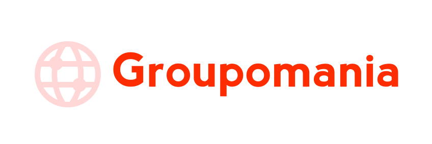
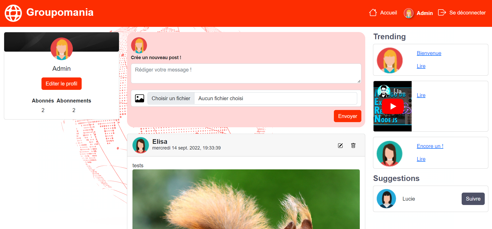
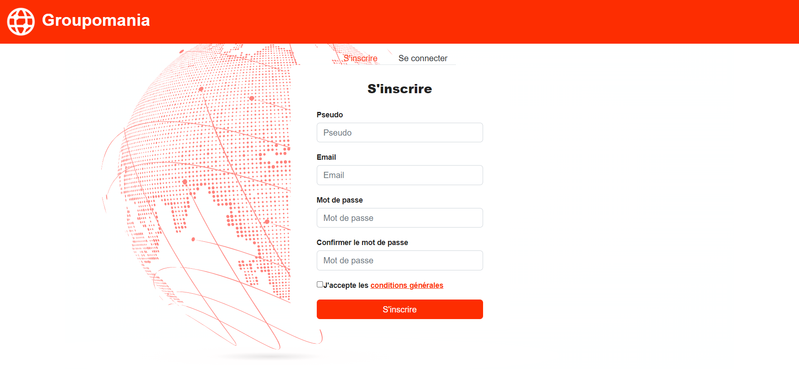
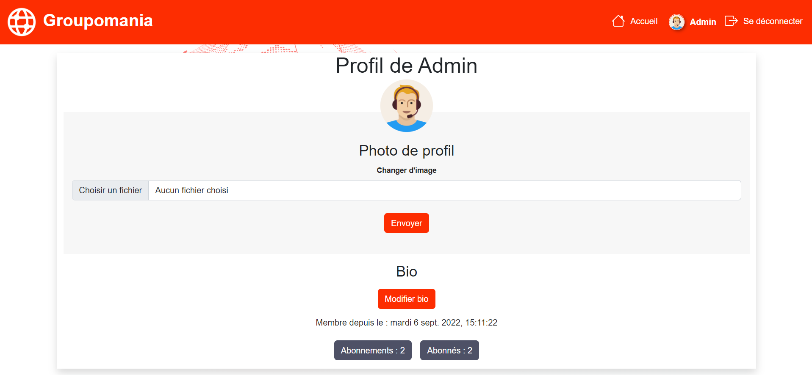
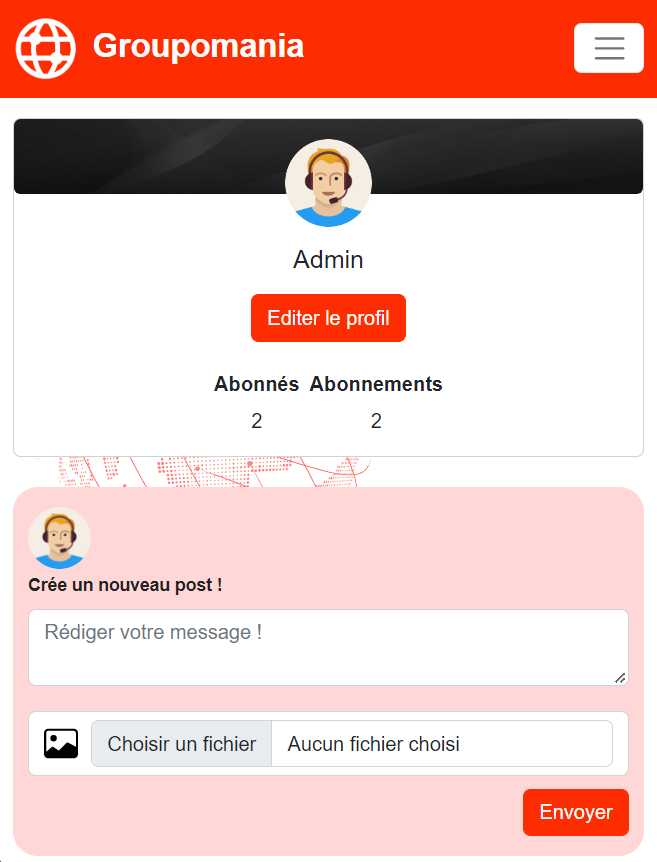
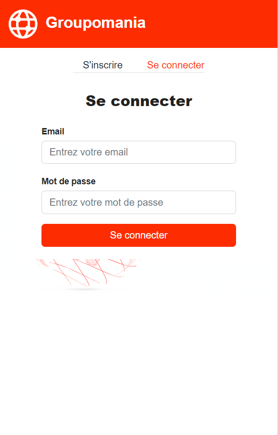
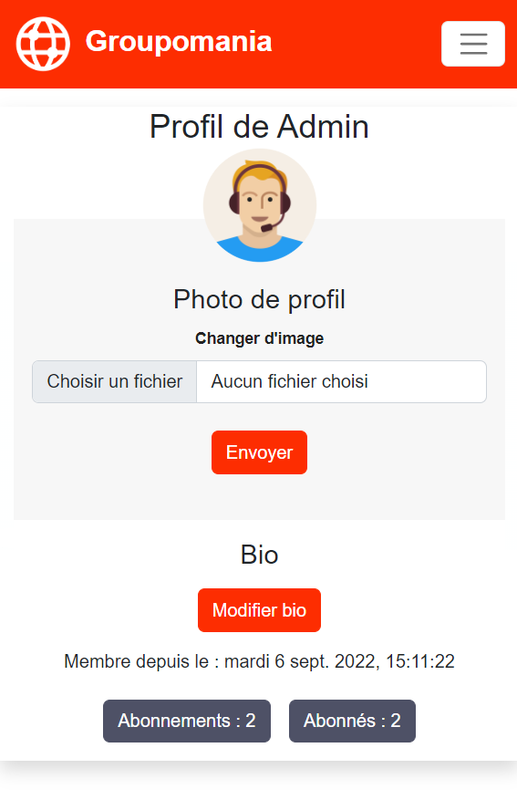

<a name="readme-top"></a>

<!-- PROJECT LOGO -->
<br />
<div align="center">
  <a href="https://github.com/ElisaGDev/P7_Groupomania">
    
  </a>

<h3 align="center">Groupomania</h3>

  <p align="center">
    Projet 7 du parcours Développeur Web d'Openclassrooms - Groupomania
    <br />
    <a href="https://github.com/ElisaGDev/P7_Groupomania"><strong>Explore the docs »</strong></a>
    <br />
    <br />
    <a href="https://github.com/ElisaGDev/P7_Groupomania">View Demo</a>
    ·
    <a href="https://github.com/ElisaGDev/P7_Groupomania/issues">Report Bug</a>
    ·
    <a href="https://github.com/ElisaGDev/P7_Groupomania/issues">Request Feature</a>
  </p>
</div>

<!-- TABLE OF CONTENTS -->
<details>
  <summary>Table des matières</summary>
  <ol>
    <li>
      <a href="#a-propos-du-projet">A propos du projet</a>
      <ul>
        <li><a href="#développé-avec">Développé avec</a></li>
      </ul>
    </li>
    <li>
      <a href="#commencement">Commencer</a>
      <ul>
        <li><a href="#prérequis">Prérequis</a></li>
        <li><a href="#installation">Installation</a></li>
      </ul>
    </li>
    <li><a href="#démo">Démo</a></li>
      <ul>
        <li><a href="#aperçu-en-vidéo">Démo en vidéo</a></li>
        <li><a href="#version-desktop">Version Desktop</a></li>
        <li><a href="#version-mobile">Version Mobile</a></li>
      </ul>
    <li><a href="#spécifications">Spécifications</a></li>
  </ol>
</details>

<!-- A propos du projet -->

## A propos du projet

[![Product Name Screen Shot][product-screenshot]](https://example.com)

Le projet consiste à construire un réseau social interne pour les employés de Groupomania. Le but de cet outil est de faciliter les interactions entre collègues.

<p align="right">(<a href="#readme-top">back to top</a>)</p>

### Développé avec

- [![Nodejs][nodejs]][nodejs-url]
- [![Express][express]][express-url]
- [![Mongo][mongo]][mongo-url]
- [![React][react.js]][react-url]
- [![Redux][redux]][redux-url]
- [![Bootstrap][bootstrap.com]][bootstrap-url]
- [![Sass][sass]][sass-url]

<p align="right">(<a href="#readme-top">back to top</a>)</p>

<!-- COMMENCEMENT -->

## Commencement

Pour installer le projet sur votre machine, suivez les instructions suivantes:

### Prérequis

- Node JS version

### Installation

1. Clonez ce repo
   ```sh
   git clone https://github.com/ElisaGDev/P7_Groupomania.git
   ```
2. Ouvrez un terminal à la racine du projet et entrez les commandes suivantes:
   ```sh
   cd Backend
   npm install
   npm start
   ```
3. Ouvrez un terminal à la racine du projet et entrez les commandes suivantes:
   ```sh
   cd client
   npm install
   npm start
   ```
4. Mettez vos informations de cluster dans /config/db.js, côté backend. Créez le fichier .env dans /config/ ajouter les donner suivante :
   ```sh
   PORT= votre port localhost pour votre Back-end(exemple 5000)
   PORT_FRONT = votre port localhost pour votre Front-end (exemple 3000)
   DB_USER_PASS= votre identifiant et mot de passe mongoDB
   USER_TOKEN_PASS= votre clé secrète aléatoire
   CLIENT_URL=http://localhost:3000 votre URL Front-end
   ```
5. Mettez vos informations de cluster dans la racine du dossier "client". Créez un fichier .env :
   `sh REACT_APP_API_URL=http://localhost:5000/ l'url de Back-end `
   <br>
   Le projet devrait se lancer sur l'adresse : http://localhost:3000
6. Importer la base de données MongoDB ou la fournir directement en créant des nouveaux utilisateurs et posts.

<p align="right">(<a href="#readme-top">back to top</a>)</p>

<!-- DEMO -->

## Démo

### Aperçu en vidéo

Vidéo

### Version Desktop

|                **Page d'accueil**                 |
| :-----------------------------------------------: |
|          |
|             **Page d'authenfication**             |
|    |
|                **Page de profil**                 |
|  |

<br>
<br>

### Version Mobile

|                   Page d'accueil                    |                  Page d'authenfication                   |                       Page de profil                       |
| :-------------------------------------------------: | :------------------------------------------------------: | :--------------------------------------------------------: |
|  |  |  |

<p align="right">(<a href="#readme-top">back to top</a>)</p>

<!-- SPECIFICATIONS -->

## Spécifications

### Côté graphique

- [x] Respecter l'identité graphique
- [x] Site web responsive

### Côté Technique

- [x] Site codé en Javascript
- [x] Utilisation d'un framework front-end Javascript
- [x] Utilisation d'une base de données

### Spécifications fonctionnelles

- [x] Page de connexion
  - [x] Un utilisateur doit avoir la possibilité de se déconnecter,
  - [x] La session de l’utilisateur persiste pendant qu’il est connecté,
  - [x] Les données de connexion doivent être sécurisées.
- [x] Page d'accueil avec la liste des posts crées
- [x] Création d’un post
  - [x] Un utilisateur doit pouvoir créer un post,
  - [x] Un post doit pouvoir contenir du texte et une image,
  - [x] Un utilisateur doit aussi pouvoir modifier et supprimer ses posts.
- [x] Système de like
- [x] Rôle administrateur

### Identité visuelle

- [x] Primaire : 
- [x] Secondaire : 
- [x] Tertiaire : 
- [x] Police : Lato

<p align="right">(<a href="#readme-top">back to top</a>)</p>

<!-- MARKDOWN LINKS & IMAGES -->
<!-- https://www.markdownguide.org/basic-syntax/#reference-style-links -->

[product-screenshot]: images/screenshot.png
[nodejs]: https://img.shields.io/badge/Node.js-43853D?style=for-the-badge&logo=nodedotjs&logoColor=white
[nodejs-url]: https://nodejs.dev/
[express]: https://img.shields.io/badge/Express.js-404D59?style=for-the-badge
[express-url]: https://expressjs.com/fr/
[mongo]: https://img.shields.io/badge/MongoDB-4EA94B?style=for-the-badge&logo=mongodb&logoColor=white
[mongo-url]: https://www.mongodb.com/
[react.js]: https://img.shields.io/badge/React-20232A?style=for-the-badge&logo=react&logoColor=61DAFB
[react-url]: https://reactjs.org/
[redux]: https://img.shields.io/badge/Redux-593D88?style=for-the-badge&logo=redux&logoColor=white
[redux-url]: https://redux.js.org/
[bootstrap.com]: https://img.shields.io/badge/Bootstrap-563D7C?style=for-the-badge&logo=bootstrap&logoColor=white
[bootstrap-url]: https://getbootstrap.com/
[sass]: https://img.shields.io/badge/Sass-CC6699?style=for-the-badge&logo=sass&logoColor=white
[sass-url]: https://sass-lang.com/
[primary]: https://img.shields.io/badge/-#FD2D01-#FD2D01
